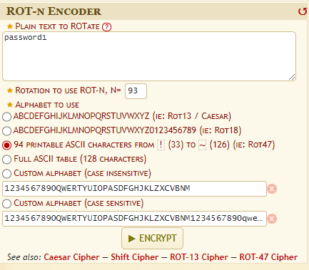

1. This is from https://github.com/noracodes/crackmes. Special thanks to Noracode!
2. To create the executable,
```sh
make crackeme02
```
# Triage
1. Let's look at the output of file.
```sh
file crackme02.64
```
Output:
```
crackme02.64: ELF 64-bit LSB pie executable, x86-64, version 1 (SYSV), dynamically linked, interpreter /lib64/ld-linux-x86-64.so.2, BuildID[sha1]=a0170ac1a429465e2933942a61f53e9944204b8c, for GNU/Linux 3.2.0, not stripped
```
2. Let's check the security features of the file.
```sh
checksec --file=crackme02.64 --output=json | jq
```
Output:
```json
{
  "crackme02.64": {
    "relro": "partial",
    "canary": "no",
    "nx": "yes",
    "pie": "yes",
    "rpath": "no",
    "runpath": "no",
    "symbols": "yes",
    "fortify_source": "no",
    "fortified": "0",
    "fortify-able": "1"
  }
}
```
- Canary is not set again.
3. Let's check whether there is any strings lying around.
```sh
strings crackme02.64
```
Output:
```
...
puts
printf
...
PTE1
u+UH
Need exactly one argument.
No, %s is not correct.
password1
Yes, %s is correct!
...
```
- Is it possible that `password1` is the password again?
# Dynamic analysis
1. Let's run the program
```sh
./crackme02.64 password1    
```
Output:
```
No, password1 is not correct.
```
2. Let's trace the library functions that were called.
```sh
ltrace ./crackme02.64 password1
```
Output:
```
printf("No, %s is not correct.\n", "password1"No, password1 is not correct.
)                                                               = 30
+++ exited (status 1) +++
```
3. Let's trace the system calls of `crackme02.64`
```sh
strace ./crackme02.64 password1
```
Output:
```
execve("./crackme02.64", ["./crackme02.64", "password1"], 0x7ffcd57ebbe8 /* 59 vars */) = 0
brk(NULL)                               = 0x558d63c89000
mmap(NULL, 8192, PROT_READ|PROT_WRITE, MAP_PRIVATE|MAP_ANONYMOUS, -1, 0) = 0x7f96ed48c000
access("/etc/ld.so.preload", R_OK)      = -1 ENOENT (No such file or directory)
openat(AT_FDCWD, "/etc/ld.so.cache", O_RDONLY|O_CLOEXEC) = 3
newfstatat(3, "", {st_mode=S_IFREG|0644, st_size=107003, ...}, AT_EMPTY_PATH) = 0
mmap(NULL, 107003, PROT_READ, MAP_PRIVATE, 3, 0) = 0x7f96ed471000
close(3)                                = 0
openat(AT_FDCWD, "/lib/x86_64-linux-gnu/libc.so.6", O_RDONLY|O_CLOEXEC) = 3
read(3, "\177ELF\2\1\1\3\0\0\0\0\0\0\0\0\3\0>\0\1\0\0\0P~\2\0\0\0\0\0"..., 832) = 832
pread64(3, "\6\0\0\0\4\0\0\0@\0\0\0\0\0\0\0@\0\0\0\0\0\0\0@\0\0\0\0\0\0\0"..., 784, 64) = 784
newfstatat(3, "", {st_mode=S_IFREG|0755, st_size=1933688, ...}, AT_EMPTY_PATH) = 0
pread64(3, "\6\0\0\0\4\0\0\0@\0\0\0\0\0\0\0@\0\0\0\0\0\0\0@\0\0\0\0\0\0\0"..., 784, 64) = 784
mmap(NULL, 1985936, PROT_READ, MAP_PRIVATE|MAP_DENYWRITE, 3, 0) = 0x7f96ed28c000
mmap(0x7f96ed2b2000, 1404928, PROT_READ|PROT_EXEC, MAP_PRIVATE|MAP_FIXED|MAP_DENYWRITE, 3, 0x26000) = 0x7f96ed2b2000
mmap(0x7f96ed409000, 348160, PROT_READ, MAP_PRIVATE|MAP_FIXED|MAP_DENYWRITE, 3, 0x17d000) = 0x7f96ed409000
mmap(0x7f96ed45e000, 24576, PROT_READ|PROT_WRITE, MAP_PRIVATE|MAP_FIXED|MAP_DENYWRITE, 3, 0x1d1000) = 0x7f96ed45e000
mmap(0x7f96ed464000, 52624, PROT_READ|PROT_WRITE, MAP_PRIVATE|MAP_FIXED|MAP_ANONYMOUS, -1, 0) = 0x7f96ed464000
close(3)                                = 0
mmap(NULL, 12288, PROT_READ|PROT_WRITE, MAP_PRIVATE|MAP_ANONYMOUS, -1, 0) = 0x7f96ed289000
arch_prctl(ARCH_SET_FS, 0x7f96ed289740) = 0
set_tid_address(0x7f96ed289a10)         = 75058
set_robust_list(0x7f96ed289a20, 24)     = 0
rseq(0x7f96ed28a060, 0x20, 0, 0x53053053) = 0
mprotect(0x7f96ed45e000, 16384, PROT_READ) = 0
mprotect(0x558d62fcf000, 4096, PROT_READ) = 0
mprotect(0x7f96ed4be000, 8192, PROT_READ) = 0
prlimit64(0, RLIMIT_STACK, NULL, {rlim_cur=8192*1024, rlim_max=RLIM64_INFINITY}) = 0
munmap(0x7f96ed471000, 107003)          = 0
newfstatat(1, "", {st_mode=S_IFCHR|0620, st_rdev=makedev(0x88, 0x1), ...}, AT_EMPTY_PATH) = 0
getrandom("\x16\x38\x2d\x9a\xf3\x8e\x96\x78", 8, GRND_NONBLOCK) = 8
brk(NULL)                               = 0x558d63c89000
brk(0x558d63caa000)                     = 0x558d63caa000
write(1, "No, password1 is not correct.\n", 30No, password1 is not correct.
) = 30
exit_group(1)                           = ?
+++ exited with 1 +++

```
- There is no information that is really useful here.
# Assembly review
1. We must use read the assembly
```
    1149:       48 83 ec 08             sub    rsp,0x8
    114d:       83 ff 02                cmp    edi,0x2 
    1150:       75 51                   jne    11a3 <main+0x5a> 
```
- First `sub rsp,0x8` , we will increase the size of the stack (For 1 memory address or for 8 characters we don't know yet)
- `cmp edi,0x2`: If value in `edi` register is not 2, jump to address `11a3`
- According to [Wikipedia](https://en.wikipedia.org/wiki/X86_calling_conventions#System_V_AMD64_ABI), The first six integer or pointer arguments are passed in registers RDI, RSI, RDX, RCX, R8, R9
- Since the signature of the main function is `int main(int argc, char** argv)`, RDI holds the value of `argc` (The number of input arguments)
- So basically, line 1150 will execute if the number of arguments provided is not 2.
- Ok, one thing to note is that apparently in [Unix](https://stackoverflow.com/questions/2050961/is-argv0-name-of-executable-an-accepted-standard-or-just-a-common-conventi#:~:text=Under%20*nix%20type%20systems%20with,0%5D%20usually%20the%20program%20name.), when any executable is run, the `argv[0]` of the main function must be the program name.
- So, basically, we only need to supply 1 argument to the executable (in the command line interface) for it to not jump.

2. Section of code starting at line `11a3`.
```
	11a3:       48 8d 3d 5a 0e 00 00    lea    rdi,[rip+0xe5a]        # 2004 <_IO_stdin_used+0x4>
    11aa:       e8 81 fe ff ff          call   1030 <puts@plt>
    11af:       b8 ff ff ff ff          mov    eax,0xffffffff
    11b4:       eb e8                   jmp    119e <main+0x55>
```
- Here we are loading the memory address of `rip+0xe5a` into `rdi`
- I notice that `rdi` is often used to store function arguments
- `call   1030`: Basically, call a function starting at address 1030. 
- This is followed by an unconditional jump to address 0x119e
3. Section of code starting at line `119e`
```
    119e:       48 83 c4 08             add    rsp,0x8
    11a2:       c3                      ret
```
- This will just decrease the size of the stack and return. 
- Notice that there is the size of stack removed is equal to the size of stack allocated at the beginning

4. Let's look at what is contained at `rip+0xe5a`.
```
xxd -s 0x2004 -l 0x40 crackme02.64
```
- `-s`: Specify offset to start looking
- `-l`: Specify the size of bytes to observe
Output:
```
00002004: 4e65 6564 2065 7861 6374 6c79 206f 6e65  Need exactly one
00002014: 2061 7267 756d 656e 742e 004e 6f2c 2025   argument..No, %
00002024: 7320 6973 206e 6f74 2063 6f72 7265 6374  s is not correct
00002034: 2e0a 0070 6173 7377 6f72 6431 0059 6573  ...password1.Yes
```
- So, `lea    rdi,[rip+0xe5a]` is actually loading the address of "Need exactly one argument"
In conclusion, we can see that it is something like this:
```c
if (argc!=1){
	printf('%s', 'Need exactly one argument');
	return;
}
```

5. Now, let's see what happens when `1150` is not executed (`edi`=2),
```
    1152:       48 8b 76 08             mov    rsi,QWORD PTR [rsi+0x8]
    1156:       b8 70 00 00 00          mov    eax,0x70
    115b:       b9 00 00 00 00          mov    ecx,0x0
    1160:       48 8d 3d d0 0e 00 00    lea    rdi,[rip+0xed0]        # 2037 <_IO_stdin_used+0x37>
    1167:       0f b6 14 0e             movzx  edx,BYTE PTR [rsi+rcx*1]
    116b:       84 d2                   test   dl,dl
    116d:       74 19                   je     1188 <main+0x3f>
```
- `rsi` is the second argument in the Linux x86_64 calling convention, that is `argv`. `argv[1]` or `rsi+0x8` will point to the string passed in as argument when calling the executable.
- We then load some constants into `eax` and `ecx`
- The address `0x2037` points to `password1`, but we know that `password1` is not the correct password. This address is stored in `rdi` (first argument of a function)
```
00002037: 7061 7373 776f 7264 3100 5965 732c 2025  password1.Yes, %
00002047: 7320 6973 2063 6f72 7265 6374 210a 0000  s is correct!...
00002057: 0001 1b03 3b2c 0000 0004 0000 00c8 efff  ....;,..........
00002067: ff78 0000 00f8 efff ffa0 0000 0008 f0ff  .x..............
```
- `rcx` will contain 0. `edx` will contain the character referenced at `rsi` memory address at a certain offset (`rsi+0x0`)
- Since we only care about the lower byte of `edx`, we will compare `dl`
- `test   dl,dl` will set the zero flag if `dl` is 0. Essentially, it is equivalent to `cmp dl, 0`

6. Let's look at what happens if we jump to `1188` if `dl` is 0.
```
    1188:       48 8d 3d b2 0e 00 00    lea    rdi,[rip+0xeb2]        # 2041 <_IO_stdin_used+0x41>
    118f:       b8 00 00 00 00          mov    eax,0x0
    1194:       e8 a7 fe ff ff          call   1040 <printf@plt>
    1199:       b8 00 00 00 00          mov    eax,0x0
    119e:       48 83 c4 08             add    rsp,0x8
    11a2:       c3                      ret
```
- The string stored at `2041` is `Yes, %s is correct!`. So, obviously this is where we want to arrive at.
```
 xxd -s 0x2041 -l 0x20 crackme02.64
00002041: 5965 732c 2025 7320 6973 2063 6f72 7265  Yes, %s is corre
00002051: 6374 210a 0000 0001 1b03 3b2c 0000 0004  ct!.......;,....
```
- I sort of notice that `rdi` will contain the pointer to the string and last 32-bits of `rax` register contains the number of arguments supplied to all variadic functions (functions that can hold a variable number of arguments).
- Main will then return 0 because the argument to return main is always located in `rax` and in this case, `mov    eax,0x0`
We can see it is something like this:
```c
if (argv[1][0]==0){
	printf('Yes, %s is correct!', argv[1]);
	return 1;
}
```
- Lol in other words, we just have to send a string will a null byte or an empty string to the executable as the password

7. Let's see what happens if we don't jump at `116d`
```
    1167:       0f b6 14 0e             movzx  edx,BYTE PTR [rsi+rcx*1]
    116b:       84 d2                   test   dl,dl
    116d:       74 19                   je     1188 <main+0x3f>
    116f:       0f be c0                movsx  eax,al
    1172:       83 e8 01                sub    eax,0x1
    1175:       0f be d2                movsx  edx,dl
    1178:       39 d0                   cmp    eax,edx
    117a:       75 3a                   jne    11b6 <main+0x6d>
    117c:       48 83 c1 01             add    rcx,0x1
    1180:       0f b6 04 0f             movzx  eax,BYTE PTR [rdi+rcx*1]
    1184:       84 c0                   test   al,al
    1186:       75 df                   jne    1167 <main+0x1e>
```
- `movzx  edx,BYTE PTR [rsi+rcx*1]`: We can see that edx will store the character at a certain offset from `rsi` which is `argv[1]`. This is sort of like `argv[1][i]`
- From line `1156`, we can see that eax = 0x70, which means that al = 0x70. So, `eax` will be equal to `0x0000 0070` at first. It is also the ascii hex value for `p`
- At `1172`, `eax` will now be `0x0000 0069` in the first loop. It is also the ascii value of `o`
- `ecx` should be 0 initially.
- `movsx  edx,dl`: will extend the lower byte of edx and store it in edx
- `cmp eax,edx`: Test whether eax is equal to edx
- `jne    11b6 <main+0x6d>`: If eax is not equal to edx, we will jump to `0x11b6` 
- If the `eax` is equal to `edx`, we will increase `rcx` by 1.
- `movzx  eax,BYTE PTR [rdi+rcx*1]`: Looks like `eax` will first store the memory referenced at `rdi+rcx*1`
- `test   al,al`: We will test whether `al` is 0.
- If it is not 0, it will loop to `0x1167`
- If it is 0/null byte, the loop will stop and continue execution to return 1, which means we have a second winning condition!
- In conclusion, this loop is something like this
```c
char[] string = "password1";
for (char * p=argv[1], int i =0; *p; p++, i++){
	if(*p!=string[i]-1){
		return -1;
	}
}
return 1;
```

8. Let's see what happens at `0x119e`
```
    11b6:       48 8d 3d 62 0e 00 00    lea    rdi,[rip+0xe62]        # 201f <_IO_stdin_used+0x1f>
    11bd:       b8 00 00 00 00          mov    eax,0x0       
    11c2:       e8 79 fe ff ff          call   1040 <printf@plt>
    11c7:       b8 01 00 00 00          mov    eax,0x1
    11cc:       eb d0                   jmp    119e <main+0x55>
```
- The string located at `0x201f` is 
```sh
xxd -s 0x201f -l 0x20 crackme02.64
0000201f: 4e6f 2c20 2573 2069 7320 6e6f 7420 636f  No, %s is not co
0000202f: 7272 6563 742e 0a00 7061 7373 776f 7264  rrect...password
```
- This definitely not where we want to go
- Then, we will jump to `0x119e` and return with -1 (`mov eax,0x1`)

9. To solve this, we can just run
```sh
./crackme02.64 ""
```
- The program will detect that the first byte is \\x00 and give us the flag.
10. Or we can perform ROT -1 on the string to get the password (Or ROT 93) 
![[Rot.png]] 

Output:
```
o`rrvnqc0
```
11. Then, let's run it
```sh
./crackme02.64 'o`rrvnqc0'
```
Output:
```
Yes, o`rrvnqc0 is correct!
```